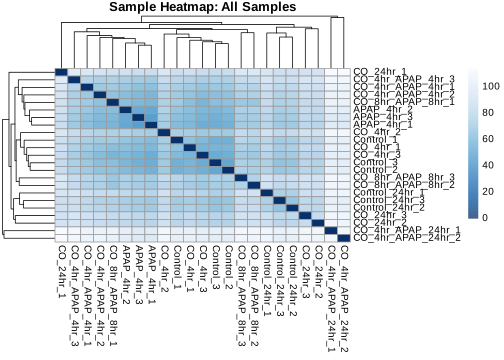
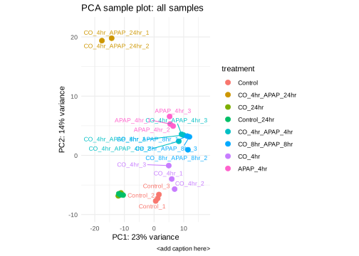

### Contents consists of all differential expression analysis outputs generated by the clean_counts or differential_expression rules in teh snakemake pipeline as well as outputs of from the jupyter notebook for expanded constrasts secondary analysis.
(e.i. contains everything past generating raw counts matrix - but nothing pertaining to WGCNA outputs)

1. [tpm_counts.csv](../de_analysis/tpm_counts.csv)
    - generated by clean_counts rule containing counts.txt data but also transcript per million variables for each sample with converted values for counts
    - also has updated names that encode sample's condition variable values as parsable strings that support the creation of the "coldata" metadata table required for DESeq2 analysis
1. [coldata.csv](../de_analysis/coldata.csv) 
   - generated by the differential_expression rule inside the code of the [DEanalysis_expandedContrasts.R](../scripts/DEanalysis_expandedContrasts.R)
    - created to enable inspection to ensure that the metadata for the DESeq2 hypothesis
1. [counts_matrix.csv](../de_analysis/counts_matrix.csv) 
    - generated by the differential_expression rule inside the code of the [DEanalysis_expandedContrasts.R](../scripts/DEanalysis_expandedContrasts.R)
    - is counts matrix that matches content of counts.txt but with updated column names to reflect the experimental conditions for that given sample
1. [expandedContrasts_AllTestData_tpm_counts.csv](../de_analysis/expandedContrasts_AllTestData_tpm_counts.csv)
   - includes all of the results of the statistical tests run between all of the contrasts
1. [expandedContrastsDIRECTION_tpm_counts.csv](../de_analysis/expandedContrastsDIRECTION_tpm_counts.csv)
   - contains all of the directional data for statistical contrasts between each sample encoded in categorical data "upregulated" downregulated" and "not significant" values
1. [expandedContrastsL2FC_tpm_counts.csv](../de_analysis/expandedContrastsL2FC_tpm_counts.csv)
   - contains all of the magnitude and direction of the perturbation for each gene as generated by the DESeq pipeline
1. [expandedContrastsPADJ_tpm_counts.csv](../de_analysis/expandedContrastsPADJ_tpm_counts.csv)
    - contains all of the adjusted p-values from the DESeq statistical test results for each contrast
    - this implicitly states whether a gene's expression perturbation is statistically significant
    - used to subset the data frames held within the csvs to only include genes that were found to be DEGs in at least one of the contrasts
1. [feature_matrix.csv](../de_analysis/feature_matrix.csv)
    - contains all of the data in the features space used for clustering DEGs into modules
    - this is not equivelant to WGCNA or related module detection workflows that are agnostic to experimental design; here experimental design is baked in
    - consists of normalized $log_{2}(fc)$ values for each contrast along with derived features relating genes to specific factors in the bench experiment.
    - it provides the dimensionsty measures used, upon which distance and correlation measures are performed providing the necessary similarity measures for hierarchical clustering
1. Visuals:
    - expandedContrasts_plots: directory of volcano plots for each 
    
    - sample distance heatmap:

        

    - sample distance pca plot:
    
        
        
Plots indicate sufficient cohesion between replicates of each experimental group
while also showing high separation. The most similar experimental groups are the the 4 hour  and 8 hour bi-treatment exposures. There is several instances of separation within experimental groups. High levels of inter-experimental group separation are seen in replicate 1 of the 8 hour bi-treatment group and in replicate 1 of the 24 hour CO group, as seen in its separation from the rest of this group in the dendrograms. The pca plot still shows that these groups account for the same variation in all of the counts data to a higher degree than the members of neighboring groups. There is significant overlap in the 24 hour control and 24 hour CO exposure groups with respect to the variance captures by pc1 and pc2. It is important to note that while these principle components account for the more variance than any additional principle component, they only account for a combined 37% of the variance in the data. 
    